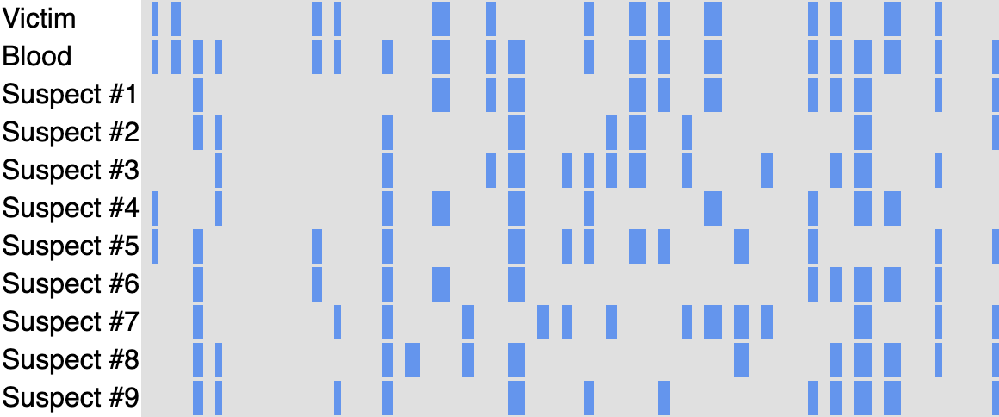

# Exam formatting tools

A Python CLI pipeline for biology instructors who turn Blackboard, BBQ, DOCX, Oklahoma, and task-CSV question banks into printable exams with shared YAML and image-aware matching output.

## From question bank to exam day

Instructors often have the content already: a Blackboard export, a generator bank, or a set of reusable matching questions. This repository supplies the conversion and layout layer between that authored content and a clean, printable exam. YAML is the inspectable handoff, so parsing and page layout stay separate.

The pipeline is especially useful when an exam includes visual evidence. Table drawings, pedigrees, sequence strips, RDKit structures, and image choices remain referenced media instead of being flattened into unreadable text.

## What instructors get

- Convert Blackboard HTML, BBQ text, Oklahoma exports, or DOCX exams into one exam YAML shape.
- Build a quiz or exam from a website task CSV with one question per resolved generator task.
- Preserve table drawings and image-capable matching prompts in the printed document.
- Produce a separate answer key for BBQ and task-CSV workflows.
- Check ZipGrade compatibility without silently deleting a distractor or changing authored content.

## Proof from a real run

The latest recorded website-task acceptance run processed 87 tasks into 82 question blocks and 119 numbered rows across seven topic chapters, with 68 rendered statement or choice images and no raw HTML in the DOCX paragraphs. The current E2E lane covers the same source-to-YAML-to-DOCX shape with quiz and exam modes.

## Screenshots

<!-- screenshots:begin (managed by screenshot-docs) -->

<!-- screenshots:end -->

## Quick start

Install the dependencies in [docs/INSTALL.md](docs/INSTALL.md), then convert a cleaned Blackboard HTML export and render its YAML as a DOCX:

```bash
source source_me.sh && python3 launchers/html_to_exam_yaml.py -i Cleaned_Final_Exam_2A.html
source source_me.sh && python3 launchers/yaml_to_exam_docx.py -i Cleaned_Final_Exam_2A.yml
```

The commands write `Cleaned_Final_Exam_2A.yml` and `Cleaned_Final_Exam_2A.docx` in the current directory. Output paths are optional; when omitted, each launcher uses the input stem with the target extension.

## A typical instructor workflow

Choose the starting point that matches the content you already maintain:

| Starting point | Launcher | Result |
| --- | --- | --- |
| Cleaned Blackboard HTML | `html_to_exam_yaml.py` | YAML with question media |
| bptools BBQ text | `bbq_to_exam_yaml.py` | YAML, answer key, and table PNGs |
| Website task CSV | `bbq_tasks_to_exam_yaml.py` | One generated question per task |
| Existing exam DOCX | `docx_to_exam_yaml.py` | Reusable YAML source |
| Exam YAML | `yaml_to_exam_docx.py` | Printable styled DOCX |

For a quiz, the task-CSV converter uses the repository copy of [bbq_settings.yml](bbq_settings.yml) by default:

```bash
source source_me.sh && python3 launchers/bbq_tasks_to_exam_yaml.py -q -t "Genetics Quiz 1" \
    -i ~/nsh/PROBLEMS/biology-problems-website/bbq_control/task_files/genetics_tasks1.csv \
    -o output_quiz/genetics_quiz1.yml
source source_me.sh && python3 launchers/yaml_to_exam_docx.py -i output_quiz/genetics_quiz1.yml
```

Each resolved task contributes one question when a usable candidate is generated. Exam mode keeps only questions that satisfy the ZipGrade A-E rules; skipped tasks are reported on stderr. See [docs/USAGE.md](docs/USAGE.md) for answer keys, alternative input formats, and filtering details.

## Documentation for instructors

- [docs/INSTALL.md](docs/INSTALL.md): dependencies, sibling checkouts, and install verification.
- [docs/USAGE.md](docs/USAGE.md): copyable commands for each conversion workflow.
- [docs/FILE_FORMATS.md](docs/FILE_FORMATS.md): accepted inputs and generated artifacts.
- [docs/YAML_EXAM_FORMAT.md](docs/YAML_EXAM_FORMAT.md): fields, matching blocks, images, and layout rules.
- [docs/EXAM_DOCUMENT_STYLES.md](docs/EXAM_DOCUMENT_STYLES.md): current DOCX styles and layout limits.
- [docs/TROUBLESHOOTING.md](docs/TROUBLESHOOTING.md): output, browser, media, and ZipGrade failures.
- [docs/FAQ.md](docs/FAQ.md): short answers about YAML, matching rows, images, and mode filtering.
- [docs/RELATED_PROJECTS.md](docs/RELATED_PROJECTS.md): the content and QTI projects that feed this pipeline.

## Documentation for maintainers

- [docs/CODE_ARCHITECTURE.md](docs/CODE_ARCHITECTURE.md): components and data flow.
- [docs/FILE_STRUCTURE.md](docs/FILE_STRUCTURE.md): where code, tests, artifacts, and docs belong.
- [docs/DEVELOPMENT.md](docs/DEVELOPMENT.md): test lanes, documentation checks, and release preparation.
- [docs/ROADMAP.md](docs/ROADMAP.md): evidence-backed follow-up work and scope boundaries.
- [docs/NEWS.md](docs/NEWS.md) and [docs/RELEASE_HISTORY.md](docs/RELEASE_HISTORY.md): release-facing summaries.

## Status and limitations

DOCX is the supported printable output. The supported HTML workflow is the two-step `html_to_exam_yaml.py` followed by `yaml_to_exam_docx.py`; the legacy direct HTML-to-DOCX and ODT paths are not part of the current pipeline. BBQ table rendering and task-CSV generation require the sibling `qti-package-maker` and `biology-problems` checkouts described in [docs/INSTALL.md](docs/INSTALL.md).

## License

Source code is licensed under [LICENSE.LGPL-3.0](LICENSE.LGPL-3.0). Documentation and other non-code material are licensed under [LICENSE.CC-BY-4.0](LICENSE.CC-BY-4.0).
